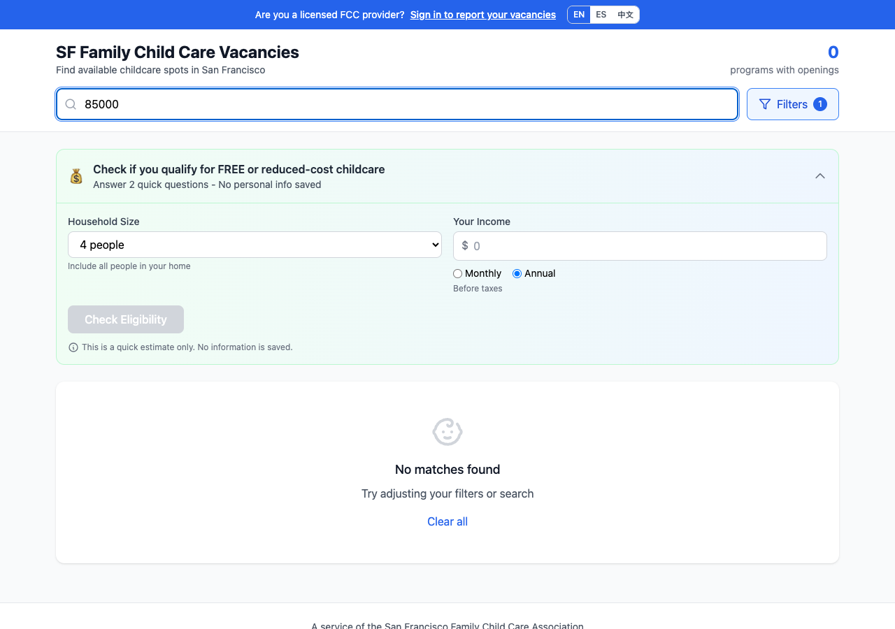
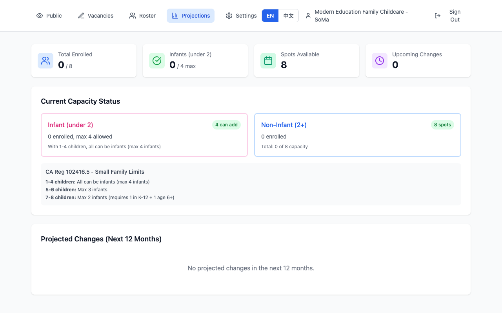

# SF Family Child Care Vacancy Registry

**Version 1.2.0-beta**

A web platform helping licensed Family Child Care providers in San Francisco report vacancies and connect with families seeking childcare. Built with CA Regulation 102416.5 compliance checking to help providers stay within licensing limits.

**Live Site:** [beta.familychildcaresf.com](https://beta.familychildcaresf.com)


## What's New in v1.2

- **Trilingual Support** - Full interface in English, Spanish (Español), and Traditional Chinese (繁體中文)
- **Financial Assistance Eligibility Screener** - Families can check if they qualify for free or reduced-cost childcare programs (ELFA, Head Start, CSPP, CalWORKs)
- **CA Regulation 102416.5 Compliance** - Real-time validation of infant limits based on total enrollment
- **Smart Auto-Fill** - Vacancy form auto-populates from roster while respecting regulatory limits
- **School-Age Capacity Rules** - Automatic capacity adjustment based on school-age enrollment criteria
- **Waitlist Support** - Providers can indicate waitlist availability when at capacity

## Features

### For Families
- **Search** licensed providers by neighborhood, age group, language, and schedule
- **Real-time availability** - see current openings, upcoming spots, and waitlist status
- **Filter** by infant, toddler, preschool, or school-age spots
- **Eligibility Screener** - check qualification for financial assistance programs:
  - SF ELFA (Early Learning For All) - Free/reduced tuition for SF residents
  - Head Start / Early Head Start
  - CA State Preschool Program (CSPP)
  - State subsidies (CalWORKs, CCTR, CAPP)
- **Multilingual** - Full interface in English, Spanish, and Chinese

### For Providers
- **Vacancy Management** - update availability by age group with compliance checking
- **Roster Tracking** - manage enrolled children, auto-calculate ages and capacity
- **Auto-Fill from Roster** - one-click vacancy reporting with CA regulation compliance
- **Capacity Projections** - visualize when children transition between age groups
- **Compliance Warnings** - real-time alerts for infant ratio violations (CA Reg 102416.5)
- **Embeddable Widget** - display live vacancy status on your own website
- **Waitlist Toggle** - indicate when accepting waitlist signups
- **CSV Import/Export** - bulk manage roster data

### CA Regulation 102416.5 Compliance

The system enforces California's infant capacity rules:

**Small Family Child Care (up to 8 children):**
| Total Children | Max Infants | Notes |
|----------------|-------------|-------|
| 1-4 | 4 | All can be infants |
| 5-6 | 3 | — |
| 7-8 | 2 | Requires 1 child in K-12 + 1 child age 6+ |

**Large Family Child Care (up to 14 children):**
| Total Children | Max Infants | Notes |
|----------------|-------------|-------|
| 1-12 | 4 | — |
| 13-14 | 3 | Requires 1 child in K-12 + 1 child age 6+ |

The system automatically:
- Calculates effective capacity based on school-age criteria
- Validates reported vacancies against projected total enrollment
- Shows warnings/errors when infant limits would be exceeded

### For Organizations (Multi-Location)
- **Dashboard** - manage all locations from a single login
- **Bulk Updates** - import/export vacancy data across locations
- **Widget Integration** - embed multi-location availability on organization website

## Tech Stack

- **Frontend:** React 18, TypeScript, Tailwind CSS
- **Backend:** Supabase (PostgreSQL, Auth, Row-Level Security)
- **Build:** Vite
- **Deployment:** Cloudflare Pages
- **Analytics:** Vercel Analytics & Speed Insights
- **i18n:** Custom React context with JSON translation files

## Architecture

```
┌─────────────────┐     ┌─────────────────┐     ┌─────────────────┐
│   Public Site   │     │ Provider Portal │     │  Org Dashboard  │
│  (React SPA)    │     │   (Auth/RLS)    │     │  (Multi-tenant) │
└────────┬────────┘     └────────┬────────┘     └────────┬────────┘
         │                       │                       │
         └───────────────────────┼───────────────────────┘
                                 │
                    ┌────────────▼────────────┐
                    │   Supabase Backend      │
                    │  - PostgreSQL Database  │
                    │  - Auth (Email/Google)  │
                    │  - Row-Level Security   │
                    │  - Public API Functions │
                    └─────────────────────────┘
```

## Database Schema

- **organizations** - Multi-location business entities
- **providers** - Individual childcare locations (can be standalone or under an org)
- **vacancies** - Current availability by age group (1:1 with provider)
- **children** - Enrolled children roster (for capacity tracking)

See [Database Design](docs/Database-Design.md) for full schema and RLS policies.

## Internationalization

The app supports three languages with full translations:

```
src/i18n/
├── en.json      # English
├── es.json      # Spanish (Español)
├── zh-TW.json   # Traditional Chinese (繁體中文)
└── LanguageContext.tsx
```

Language is auto-detected from browser settings and can be switched via the language toggle (EN | ES | 中文).

## Embeddable Widget

Providers can embed a live vacancy widget on their website:

```html
<!-- Single Provider -->
<div id="fcc-vacancy-widget" data-provider="384004210"></div>
<script src="https://beta.familychildcaresf.com/widget.js"></script>

<!-- Organization (Multiple Locations) -->
<div id="fcc-vacancy-widget"
     data-org="modern-education"
     data-link-base="https://www.example.com">
</div>
<script src="https://beta.familychildcaresf.com/widget.js"></script>
```

## External API Integration

Integrates with California's CDSS (Community Care Licensing Division) data for license verification. See [CDSS License API Documentation](docs/CDSS-License-API.md).

## Getting Started

### Prerequisites
- Node.js 18+
- Supabase account

### Installation

```bash
# Clone the repo
git clone https://github.com/mrchildcare-oscar/sf-fcc-vacancy-registry.git
cd sf-fcc-vacancy-registry

# Install dependencies
npm install

# Set up environment variables
cp .env.example .env
# Edit .env with your Supabase credentials

# Run development server
npm run dev
```

### Environment Variables

```
VITE_SUPABASE_URL=https://your-project.supabase.co
VITE_SUPABASE_ANON_KEY=your-anon-key
```

## Documentation

- [Database Design](docs/Database-Design.md) - Schema, RLS policies, API functions
- [CDSS License API](docs/CDSS-License-API.md) - California childcare license lookup
- [Provider Guide (English)](docs/Provider-Guide-EN.md)
- [Provider Guide (中文)](docs/Provider-Guide-ZH-TW.md)

## Screenshots

| Public Search | Eligibility Screener |
|---------------|---------------------|
|  |  |

| Provider Dashboard | Roster Management |
|-------------------|-------------------|
|  |  |

| Capacity Projections | Organization Dashboard |
|---------------------|----------------------|
|  |  |

## Changelog

### v1.2.0-beta (January 2026)
- Added Spanish language support
- Added financial assistance eligibility screener
- Implemented CA Reg 102416.5 compliance checking
- Smart auto-fill with regulatory validation
- School-age capacity criteria enforcement
- Waitlist availability toggle
- Clear all button for vacancy form
- Various bug fixes and UI improvements

### v1.1.0-beta
- Added Traditional Chinese language support
- Capacity projections view
- Embeddable vacancy widget
- CSV import for roster

### v1.0.0-beta
- Initial release
- Public vacancy search
- Provider vacancy reporting
- Roster management
- Organization multi-location support

## License

MIT

## Author

**Oscar Tang** - [mrchildcare-oscar](https://github.com/mrchildcare-oscar)

---

*Built to support San Francisco's Family Child Care community*
