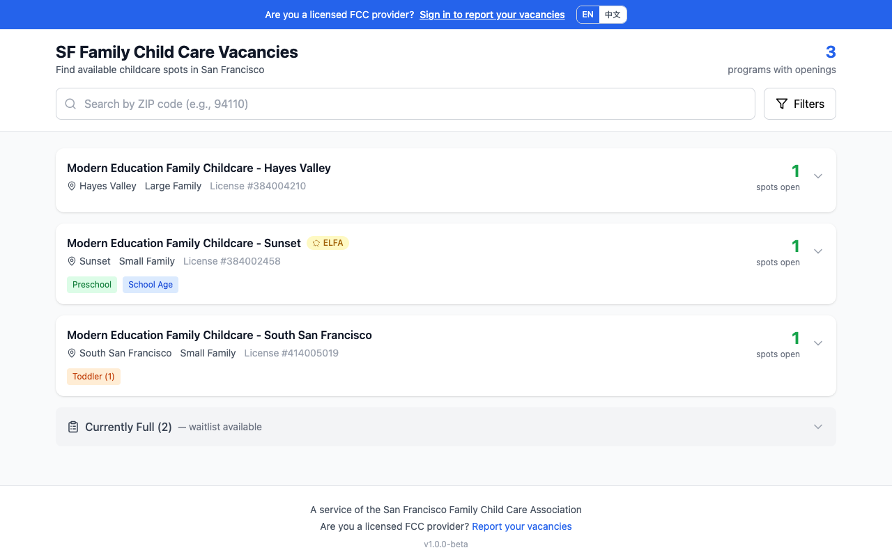
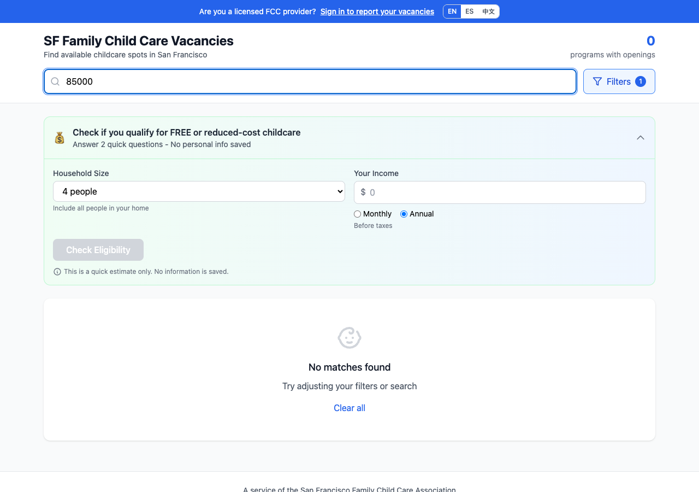
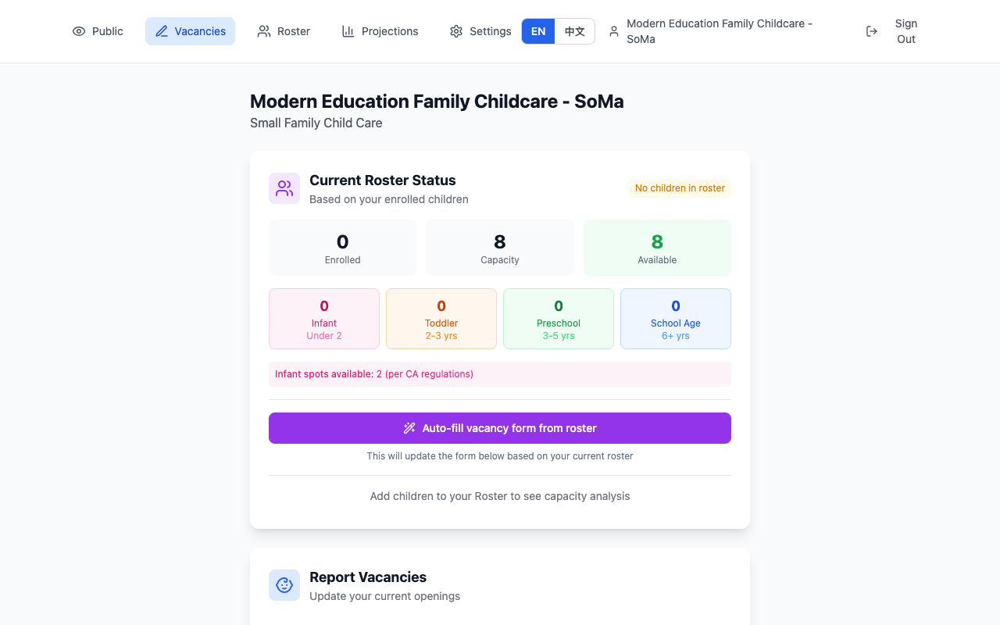
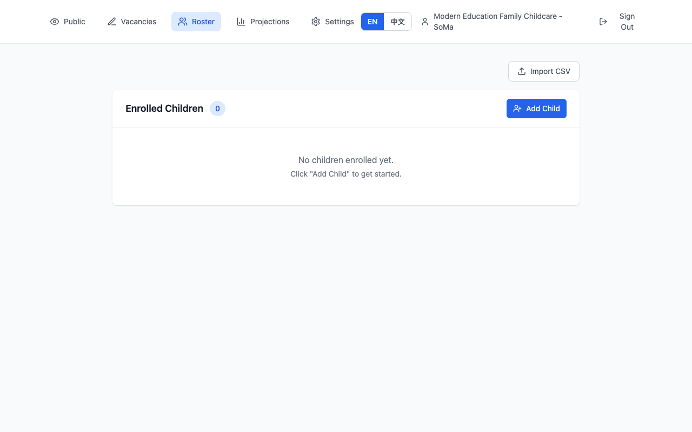
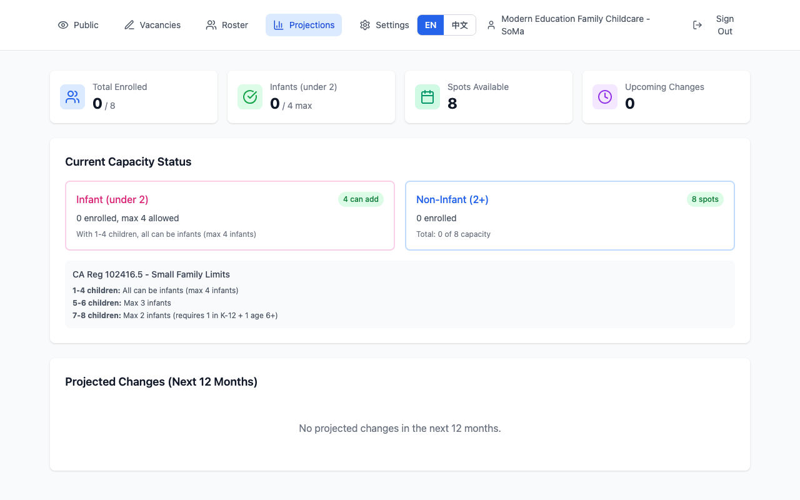
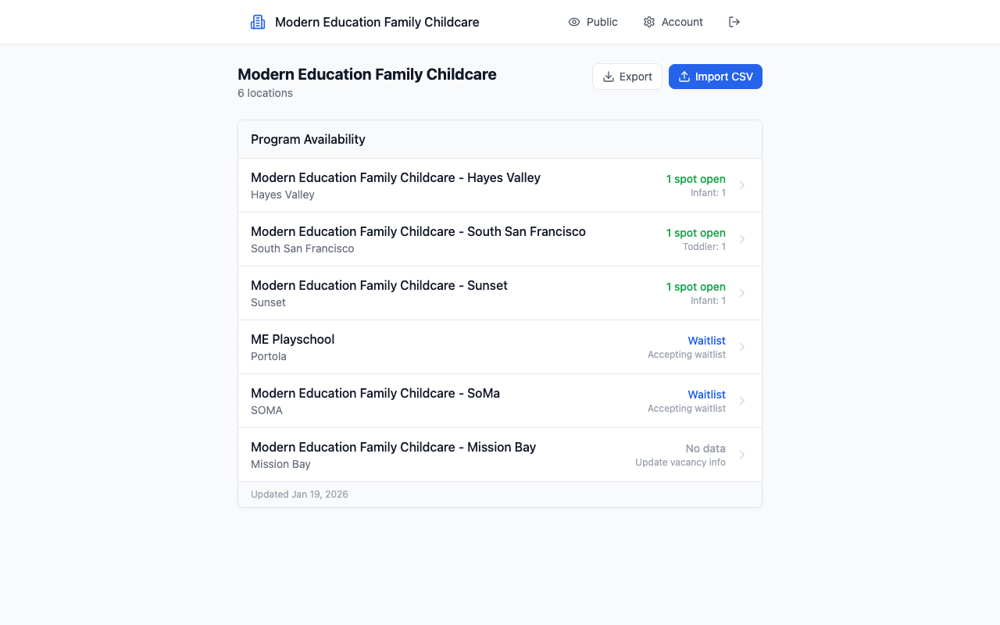

# SF Family Child Care Vacancy Registry

**Version 1.7.0**

A web platform helping licensed Family Child Care providers in San Francisco report vacancies and connect with families seeking childcare. Built with CA Regulation 102416.5 compliance checking to help providers stay within licensing limits.

**Live Site:** [familychildcaresf.com](https://familychildcaresf.com)



## Features

### For Families
- **Search** licensed providers by neighborhood, age group, language, and schedule
- **Real-time availability** — see current openings, upcoming spots, and waitlist status
- **Contact providers** — submit inquiries directly through the platform
- **Eligibility Screener** — check qualification for 7 financial assistance programs:
  - SF ELFA (Early Learning For All)
  - Head Start / Early Head Start
  - CA State Preschool Program (CSPP)
  - CalWORKs Stage 1/2/3
  - CCTR (California Center-Based)
  - CAPP (Child Care Alternative Payment)
  - State subsidies
- **Trilingual** — full interface in English, Spanish (Español), and Traditional Chinese (繁體中文)

### For Providers
- **Vacancy Management** — update availability by age group with compliance checking
- **Roster Tracking** — manage enrolled children, auto-calculate ages and capacity
- **Auto-Fill from Roster** — one-click vacancy reporting with CA regulation compliance
- **Capacity Projections** — visualize when children transition between age groups
- **Compliance Warnings** — real-time alerts for infant ratio violations (CA Reg 102416.5)
- **Inquiry Management** — receive and respond to family inquiries via email notifications
- **Embeddable Widget** — display live vacancy status on your own website
- **Waitlist Toggle** — indicate when accepting waitlist signups
- **CSV Import** — bulk roster upload
- **ELFA Network Status** — automatic verification against 372 ELFA-licensed providers
- **License Verification** — real-time lookup via CA CDSS API
- **Account Self-Service** — settings management and CCPA-compliant account deletion

### For Organizations (Multi-Location)
- **Dashboard** — manage all locations from a single login
- **Bulk Updates** — import/export vacancy data across locations
- **Widget Integration** — embed multi-location availability on organization website

### CA Regulation 102416.5 Compliance

The system enforces California's infant capacity rules:

**Small Family Child Care (up to 8 children):**
| Total Children | Max Infants | Notes |
|----------------|-------------|-------|
| 1-4 | 4 | All can be infants |
| 5-6 | 3 | — |
| 7-8 | 2 | Requires 1 child in K-12 + 1 child age 6+ |

**Large Family Child Care (up to 14 children):**
| Total Children | Max Infants | Notes |
|----------------|-------------|-------|
| 1-12 | 4 | — |
| 13-14 | 3 | Requires 1 child in K-12 + 1 child age 6+ |

The system automatically:
- Calculates effective capacity based on school-age criteria
- Validates reported vacancies against projected total enrollment
- Shows warnings/errors when infant limits would be exceeded

## Tech Stack

- **Frontend:** React 18, TypeScript, Tailwind CSS
- **Backend:** Supabase (PostgreSQL, Auth, Edge Functions, Row-Level Security)
- **Build:** Vite 6
- **Testing:** Vitest with coverage
- **Deployment:** Vercel
- **Analytics:** Vercel Analytics & Speed Insights, TruConversion
- **Email:** Resend (transactional notifications)
- **i18n:** Custom React context with JSON translation files

## Architecture

```
┌─────────────────┐     ┌─────────────────┐     ┌─────────────────┐
│   Public Site   │     │ Provider Portal │     │  Org Dashboard  │
│  (React SPA)    │     │   (Auth/RLS)    │     │  (Multi-tenant) │
└────────┬────────┘     └────────┬────────┘     └────────┬────────┘
         │                       │                       │
         └───────────────────────┼───────────────────────┘
                                 │
                    ┌────────────▼────────────┐
                    │   Supabase Backend      │
                    │  - PostgreSQL Database  │
                    │  - Auth (Email/Google)  │
                    │  - Row-Level Security   │
                    │  - Edge Functions (7)   │
                    └─────────────────────────┘
```

### Static Content Layer (SEO/AEO)

The site uses a hybrid architecture — 39 static HTML content pages are served to search engines and AI crawlers, while the React SPA handles dynamic functionality for authenticated users.

**Content pages** (`public/`) — trilingual (EN, ES, ZH-Hant), 13 pages per language:

| Page | EN | ES | ZH |
|------|----|----|-----|
| Child Care Guide | `/child-care-san-francisco/` | `/es/child-care-san-francisco/` | `/zh/child-care-san-francisco/` |
| Financial Assistance | `/financial-assistance/` | `/es/financial-assistance/` | `/zh/financial-assistance/` |
| FCC vs Centers | `/family-child-care-vs-centers/` | `/es/family-child-care-vs-centers/` | `/zh/family-child-care-vs-centers/` |
| Infant Care | `/infant-care-san-francisco/` | `/es/infant-care-san-francisco/` | `/zh/infant-care-san-francisco/` |
| **Trust Wheel Hub** | `/choose/` | `/es/choose/` | `/zh/choose/` |
| Safety & Licensing | `/choose/safety-licensing/` | `/es/choose/safety-licensing/` | `/zh/choose/safety-licensing/` |
| Educational Quality | `/choose/educational-quality/` | `/es/choose/educational-quality/` | `/zh/choose/educational-quality/` |
| Personal Connection | `/choose/personal-connection/` | `/es/choose/personal-connection/` | `/zh/choose/personal-connection/` |
| Small Group Size | `/choose/small-group-size/` | `/es/choose/small-group-size/` | `/zh/choose/small-group-size/` |
| Cultural & Language | `/choose/cultural-language-match/` | `/es/choose/cultural-language-match/` | `/zh/choose/cultural-language-match/` |
| Warmth & Family Feel | `/choose/warmth-family-feel/` | `/es/choose/warmth-family-feel/` | `/zh/choose/warmth-family-feel/` |
| Location & Convenience | `/choose/location-convenience/` | `/es/choose/location-convenience/` | `/zh/choose/location-convenience/` |
| Financial Assistance (Trust) | `/choose/financial-assistance-programs/` | `/es/choose/financial-assistance-programs/` | `/zh/choose/financial-assistance-programs/` |

**Trust Wheel** — A decision framework based on a 2026 survey of 312 SF families by FCCASF, identifying 8 trust factors families consider when choosing child care. The hub page features an interactive circular visualization linking to deep-dive pages for each factor.

Each page includes:
- JSON-LD structured data (`FAQPage`, `BreadcrumbList`, `Article` schemas)
- Open Graph and Twitter Card meta tags with `og:locale`
- Hreflang tags connecting EN / ES / ZH-Hant + x-default
- `datePublished` and `dateModified` for freshness signals
- FAQ sections matching JSON-LD for AEO (Answer Engine Optimization)
- Canonical URLs with path-based language prefixes

**Crawler access** (`robots.txt`):
- Explicitly allows GPTBot, ClaudeBot, PerplexityBot, Google-Extended
- Blocks authenticated routes (`/provider/`, `/dashboard/`)
- Sitemap with `lastmod` dates and hreflang `xhtml:link` alternates (40 URLs)

## Database Schema

- **organizations** — multi-location business entities
- **providers** — individual childcare locations (standalone or under an org)
- **vacancies** — current availability by age group (1:1 with provider), with TTL expiry
- **parent_inquiries** — family-to-provider contact requests with rate limiting

See [Database Design](docs/Database-Design.md) for full schema and RLS policies.

## Supabase Edge Functions

| Function | Purpose |
|----------|---------|
| `verify-license` | Validates provider license numbers against CA CDSS API |
| `refresh-elfa` | Syncs ELFA network status for all providers (372 licenses) |
| `send-inquiry-notification` | Emails providers when families submit inquiries |
| `send-vacancy-reminders` | Cron: sends 30-day and 40-day vacancy expiry warnings |
| `confirm-vacancy` | Email confirmation flow for vacancy updates |
| `delete-account` | CCPA-compliant self-service account deletion |
| `send-daily-report` | Cron: daily admin summary of activity |

## Internationalization

The app supports three languages with full translations:

```
src/i18n/
├── en.json      # English
├── es.json      # Spanish (Español)
├── zh-TW.json   # Traditional Chinese (繁體中文)
└── LanguageContext.tsx
```

- Auto-detected from browser settings
- Switchable via language toggle (EN | ES | 中文)
- URL parameter support (`?lang=es`, `?lang=zh`)
- Persisted to localStorage

## Embeddable Widget

Providers can embed a live vacancy widget on their website:

```html
<!-- Single Provider -->
<div id="fcc-vacancy-widget" data-provider="384004210"></div>
<script src="https://familychildcaresf.com/widget.js"></script>

<!-- Organization (Multiple Locations) -->
<div id="fcc-vacancy-widget"
     data-org="modern-education"
     data-link-base="https://www.example.com">
</div>
<script src="https://familychildcaresf.com/widget.js"></script>
```

A separate `ca-eligibility-widget.js` is also available for embedding the eligibility screener externally.

## External API Integration

Integrates with California's CDSS (Community Care Licensing Division) data for license verification. See [CDSS License API Documentation](docs/CDSS-License-API.md).

## Getting Started

### Prerequisites
- Node.js 18+
- Supabase account

### Installation

```bash
git clone https://github.com/mrchildcare-oscar/sf-fcc-vacancy-registry.git
cd sf-fcc-vacancy-registry
npm install
cp .env.example .env
# Edit .env with your Supabase credentials
npm run dev
```

### Environment Variables

```
VITE_SUPABASE_URL=https://your-project.supabase.co
VITE_SUPABASE_ANON_KEY=your-anon-key
VITE_ADMIN_EMAILS=admin@example.com
```

### Scripts

```bash
npm run dev          # Start development server
npm run build        # TypeScript check + Vite build
npm run preview      # Preview production build
npm test             # Run tests
npm run test:watch   # Run tests in watch mode
npm run test:coverage # Run tests with coverage report
```

## Documentation

- [Database Design](docs/Database-Design.md) — Schema, RLS policies, API functions
- [CDSS License API](docs/CDSS-License-API.md) — California childcare license lookup
- [Provider Guide (English)](docs/Provider-Guide-EN.md)
- [Provider Guide (中文)](docs/Provider-Guide-ZH-TW.md)
- [Demo Script](docs/Demo-Script.md) — Presentation talking points
- [Marketing & Sustainability Plan](docs/MARKETING_AND_SUSTAINABILITY_PLAN.md)
- [Trust Wheel Usability Walkthrough](docs/usability-walkthrough-trust-wheel.md) — 3 parent persona walkthroughs

## Screenshots

| Public Search | Eligibility Screener |
|---------------|---------------------|
|  |  |

| Provider Dashboard | Roster Management |
|-------------------|-------------------|
|  |  |

| Capacity Projections | Organization Dashboard |
|---------------------|----------------------|
|  |  |

## Changelog

### v1.7.0 (March 2026)
- **Trust Wheel Content Hub** — 27 new pages (9 EN + 9 ES + 9 ZH) with interactive wheel visualization and 8 deep-dive factor pages based on 312-family survey data
- **Multilingual content retrofit** — Split 4 tri-language pages into 12 single-language files with path-based routing (`/es/`, `/zh/`) and proper hreflang tags
- **SEO/AEO overhaul** — FAQPage + Article + BreadcrumbList JSON-LD on all 39 pages, `og:locale`, `datePublished`, sitemap with `lastmod` and hreflang alternates
- **Homepage integration** — "Why Family Child Care" section now links to Trust Wheel factor pages with survey-backed stats
- **ELFA Quality Standards** — Replaced deprecated QRIS references with SF DEC's 5 quality standards (CLASS, ASQ, DRDP)
- **Accessibility** — Language switcher on content pages uses `<a>` links instead of JS toggle; each page is single-language HTML with correct `<html lang>`
- **40 crawlable URLs** in sitemap (up from 5), AI crawlers explicitly allowed

### v1.6.0 (March 2026)
- Parent inquiry email improvements (personalized sender, streamlined templates)
- Provider value proposition CTA on landing page
- Vercel Analytics integration

### v1.5.0 (February 2026)
- Production launch — site moved from beta.familychildcaresf.com to familychildcaresf.com
- "Why Family Child Care" banner for first-time visitors
- Auto-fill confirmation dialog
- Default login switched to password (Magic Link as alternative)

### v1.4.0
- Self-service account deletion (CCPA compliance)
- Vacancy expiry reminders (30-day and 40-day email warnings)
- Daily admin diagnostic report
- Error boundary improvements

### v1.3.0
- Parent inquiry system with email notifications
- Anti-abuse protections and rate limiting on inquiries
- Provider-only slot visibility (public sees openings, not exact counts)
- Vacancy stats and random provider ordering
- Hash-based URL routing
- Analytics switched from Vercel to TruConversion
- Admin ELFA refresh tool
- Security fixes (RLS, admin page auth)

### v1.2.0 (January 2026)
- Spanish language support
- Financial assistance eligibility screener
- CA Reg 102416.5 compliance checking
- Smart auto-fill with regulatory validation
- Waitlist availability toggle

### v1.1.0-beta
- Traditional Chinese language support
- Capacity projections view
- Embeddable vacancy widget
- CSV import for roster

### v1.0.0-beta
- Initial release
- Public vacancy search
- Provider vacancy reporting
- Roster management
- Organization multi-location support

## License

MIT

## Author

**Oscar Tang** — [mrchildcare-oscar](https://github.com/mrchildcare-oscar)

---

*Built to support San Francisco's Family Child Care community*
