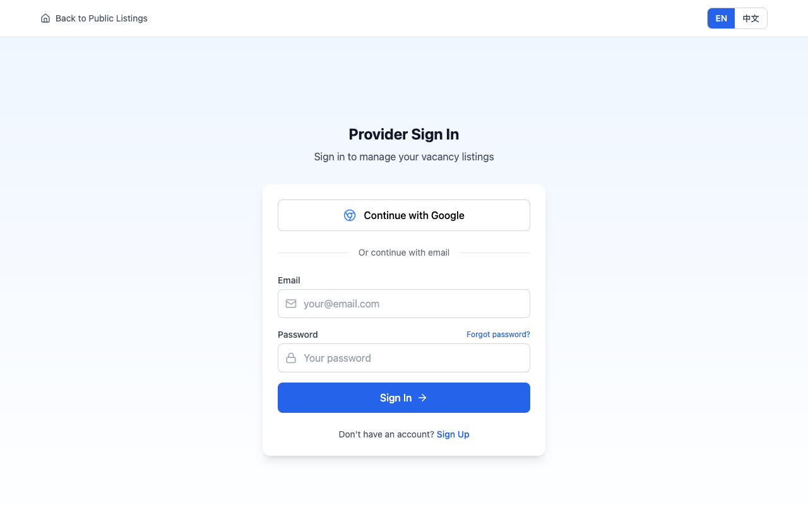
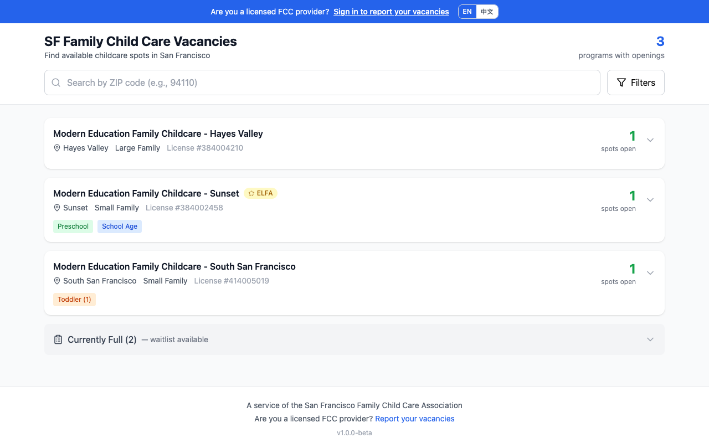
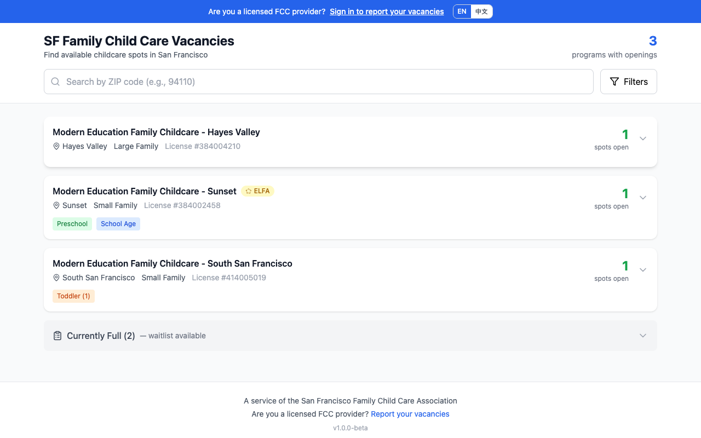
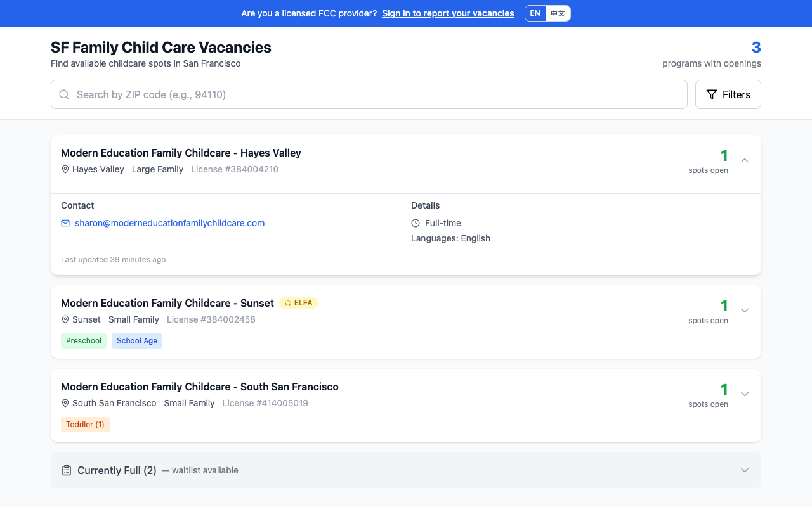
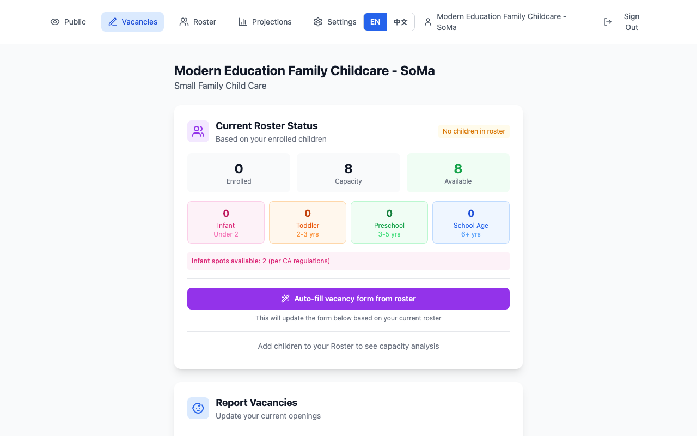
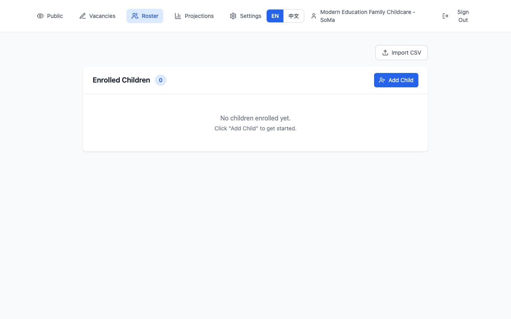
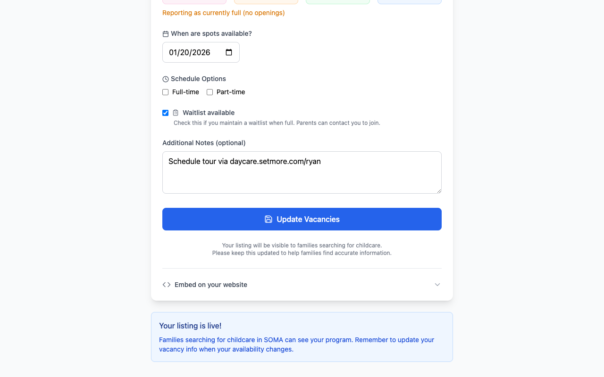
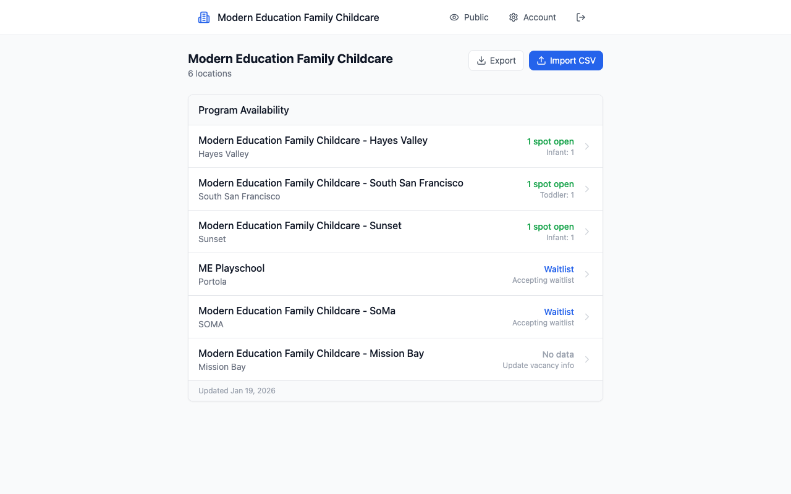

# 舊金山家庭托兒空缺登記系統
## 服務提供者指南（測試版）

歡迎使用舊金山家庭托兒空缺登記系統！此平台幫助舊金山持照家庭托兒服務提供者報告空缺名額，並與尋找托兒服務的家庭建立聯繫。

---

## 開始使用

### 1. 註冊/登入
- 訪問平台並點擊「報告您的空缺」
- 您可以使用 Google 帳號登入，或使用電子郵件建立帳號
- 首次使用者將會進入設定流程


*使用 Google 或電子郵件登入以進入服務提供者後台*

### 2. 驗證執照
- 輸入您的9位數加州家庭托兒執照號碼
- 系統會自動與州政府資料庫驗證您的執照
- ELFA 網絡會員身份會自動偵測

### 3. 完成您的資料
- 機構名稱（家庭會看到的名稱）
- 服務類型（小型家庭托兒最多8名兒童，或大型家庭托兒最多14名）
- 地點（郵遞區號和社區）
- 聯絡資訊（電話、電子郵件、網站）
- 使用語言

---

## 主要功能

### 公開列表
您的機構會出現在公開搜尋頁面，讓家庭可以找到您：


*家庭尋找托兒服務的主要搜尋頁面*

家庭可以按社區、年齡組別、語言和時間篩選結果：


*篩選選項幫助家庭找到合適的托兒服務*

當家庭點擊列表時，可以看到更多詳細資訊：


*展開檢視顯示聯絡資訊和機構詳情*

### 報告空缺
讓家庭了解您的可用名額：
- **按年齡組別**：嬰兒（2歲以下）、幼兒（2-3歲）、學前兒童（3-5歲）、學齡兒童（6歲以上）
- **時間選項**：全日、半日，或兩者皆可
- **開放日期**：名額何時開放
- **候補名單**：即使已滿，也可讓家庭知道您接受候補登記


*按年齡組別更新您的空缺資訊*

### 名冊管理
追蹤您已註冊的兒童（選用但很有幫助）：
- 只需輸入出生日期即可新增兒童（姓名為選填，保護隱私）
- 系統自動計算年齡和年齡組別
- 查看兒童年齡超過或升入幼稚園時即將開放的名額
- 根據您的名冊自動填入空缺表單
- 透過 CSV 檔案匯入名冊，快速設定


*查看所有已註冊兒童的年齡和年齡組別*

### 容量預測
透過自動計算提前規劃：
- 查看兒童何時會轉換到下一個年齡組別
- 了解何時會因升入幼稚園而有空缺
- 內建加州嬰兒比例合規計算


*視覺化時間軸顯示年齡組別轉換的時間點*

### 網站嵌入小工具（新功能！）
在您自己的網站上直接顯示空缺狀態：
- 更新空缺後，在表單底部找到「嵌入到您的網站」
- 複製程式碼片段並貼到您的網站
- 適用於任何網站建立工具（Wix、Squarespace、WordPress 等）
- **自動更新** - 當您更改空缺資訊時，網站上也會同步更新！


*複製嵌入程式碼，在您的網站上新增即時空缺小工具*

**嵌入程式碼範例：**
```html
<div id="fcc-vacancy-widget" data-provider="您的執照號碼"></div>
<script src="https://beta.familychildcaresf.com/widget.js"></script>
```

這樣一來，造訪您網站的家庭隨時都能看到最新的空缺資訊。

### 多據點管理後台（新功能！）
如果您管理多個托兒據點，可以從一個後台查看和管理所有據點：


*機構負責人可以一目了然地查看所有據點及其空缺狀態*

功能包括：
- 在一個頁面查看所有據點的空缺狀態
- 快速更新任何據點的空缺資訊
- 透過 CSV 匯入/匯出空缺資料
- 下載含範例資料的樣板檔案

---

## 報告「已滿」狀態

如果您目前沒有空缺：
- 將所有名額設為 0
- 如果您接受候補登記，請勾選「候補名單開放」
- 您的機構會出現在「目前已滿」區塊
- 家庭仍然可以聯繫您加入候補名單

---

## 給服務提供者的建議

1. **保持列表更新** - 家庭依賴準確的資訊
2. **有變動時立即更新** - 有新空缺？有兒童要離開？請立即更新
3. **使用名冊功能** - 它能自動預測未來的空缺
4. **勾選「候補名單」選項** - 即使已滿，家庭也想提前規劃
5. **在您的網站上添加小工具** - 讓造訪您網站的家庭即時看到空缺狀態

---

## 測試版 - 我們需要您的意見！

此平台目前正在進行測試。您的意見對於改善所有舊金山家庭托兒服務提供者的體驗非常寶貴。

### 請分享：
- 您在管理空缺和招生時**遇到的挑戰**
- 您希望平台**新增的功能**
- 使用系統時**發現的問題或錯誤**
- 根據您的經驗提出的**改進建議**

### 如何提交意見：
請將您的意見發送至：**oscar.fccasf@gmail.com**

請包含：
- 您想要做什麼
- 發生了什麼（或沒有發生什麼）
- 您的任何建議

您的意見直接影響這個平台的發展方向。感謝您參與讓舊金山的托兒服務更加便利！

---

## 有問題嗎？

如果您有問題或需要幫助，請聯繫：**Oscar Tang**，電子郵件：**oscar.fccasf@gmail.com**

---

---

## 最新功能（2025年1月）

- **嵌入小工具** - 在您自己的網站上直接顯示空缺狀態
- **帳號設定** - 隨時從設定選單更改密碼
- **多據點支援** - 擁有多個據點的服務提供者可以從一個帳號管理所有據點（請聯繫我們進行設定）

---

*這是測試版本。功能可能會根據服務提供者的意見而有所變動。*
